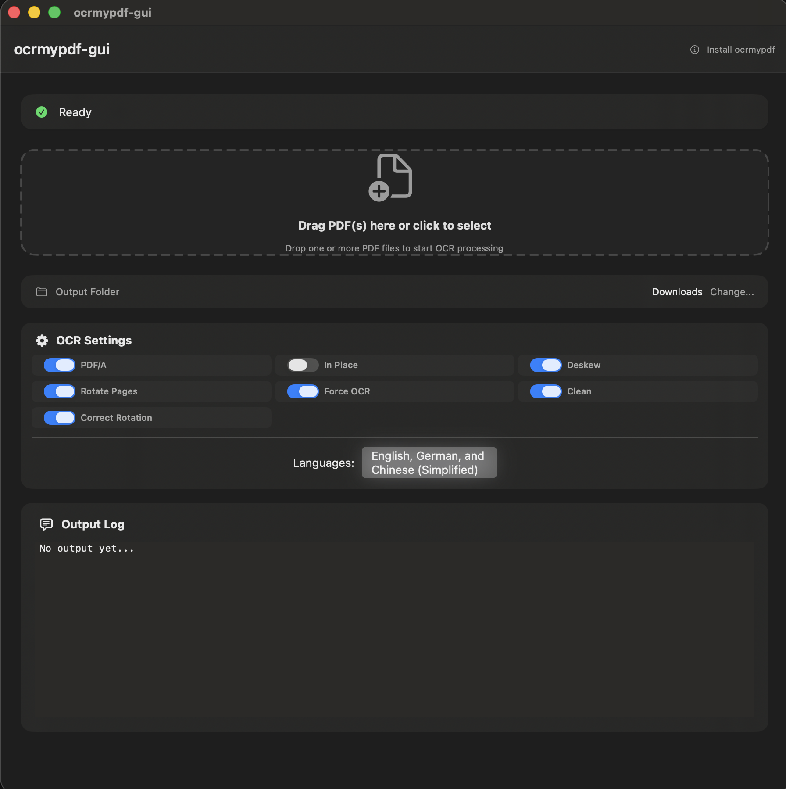

# ocrmypdf-gui

A modern macOS GUI application for OCRMyPDF, providing an intuitive interface to perform OCR (Optical Character Recognition) on PDF files with drag-and-drop support and batch processing.

**Version 0.8** | Requires macOS 13.5+



## Features

- **Drag & Drop Support**: Easily process PDF files by dragging them into the app or clicking to select
- **Batch Processing**: Process multiple PDF files sequentially with progress tracking
- **Real-time Output**: View live command-line output with selectable text
- **Progress Tracking**: See detailed status including "File X of Y" for batch operations
- **Configurable Options**: 
  - Deskew pages (enabled by default)
  - Rotate pages (enabled by default)
  - Correct page rotation (enabled by default)
  - Force OCR on all pages (enabled by default)
  - Clean pages (enabled by default)
  - Compress PDF (reduce file size with lossy compression)
  - Output to PDF/A format (enabled by default)
  - In-place processing (overwrite original files)
  - Custom output folder selection
- **Multi-language Support**: OCR in multiple languages including:
  - Chinese (Simplified)
  - Chinese (Traditional/Cantonese)
  - Dutch
  - English
  - French
  - German
  - Polish
  - Portuguese
- **Apple Glass Design**: Modern, translucent UI following macOS design guidelines
- **Siri & Shortcuts Integration**: Run OCR via Siri or Shortcuts app

## Requirements

- macOS 13.5 (Ventura) or later
- [Homebrew](https://brew.sh/) installed
- `ocrmypdf` installed via Homebrew
- `tesseract-lang` installed via Homebrew (for language support)

## Installation

### 1. Install Dependencies

First, install the required command-line tools using Homebrew:

```bash
# Install ocrmypdf
brew install ocrmypdf

# Install Tesseract language data (for multi-language OCR support)
brew install tesseract-lang
```

### 2. Install the Application

1. Download the latest release from the [Releases](https://github.com/nexusparadise/ocrmypdf-gui/releases) page
2. Open the downloaded `.dmg` file
3. Drag `ocrmypdf-gui.app` to your Applications folder
4. Launch the application from Applications or Spotlight

Alternatively, if you're building from source:

1. Open `ocrmypdf-gui.xcodeproj` in Xcode
2. Select your development team in the Signing & Capabilities section
3. Build and run (⌘R)

## Usage

### Basic Usage

1. **Launch the application**
2. **Select or drop PDF files**:
   - Click the drop zone to select files using the file picker
   - Or drag and drop one or more PDF files onto the drop zone
3. **Configure options** (optional):
   - Adjust OCR settings in the compact settings panel (always visible)
   - Select languages for OCR recognition
   - Choose an output folder (defaults to Downloads)
   - Access additional settings via the Settings menu (⌘,)
4. **Process**: The app will automatically start processing when files are selected or dropped
5. **View results**: 
   - Watch the real-time output in the log area
   - See progress status at the top
   - Use "Open PDF" or "Show in Finder" buttons when processing completes

### Settings

- **Deskew**: Automatically correct skewed/scanned pages (enabled by default)
- **Rotate Pages**: Automatically rotate pages to correct orientation (enabled by default)
- **Correct Page Rotation**: Correct page rotation based on detected orientation (enabled by default)
- **Force OCR**: Perform OCR on all pages, even if they already contain text (enabled by default)
- **Clean**: Clean and denoise pages before OCR (enabled by default)
- **Compress PDF**: Compress PDF files to reduce file size using lossy JPEG/JPEG2000 optimization (disabled by default)
- **Output PDF/A**: Create PDF/A compliant output files (enabled by default)
- **In Place**: Overwrite original files instead of creating new ones with " ocr" suffix (disabled by default)
- **Output Folder**: Choose where processed files are saved (defaults to Downloads)
- **Languages**: Select one or more languages for OCR recognition (defaults to English)

### Batch Processing

When processing multiple files:
- Files are processed sequentially (one at a time)
- Progress is shown as "File X of Y" with a progress bar
- Real-time status updates show which file is currently being processed
- Output from all files accumulates in the log (not cleared between files)
- Settings are locked during processing to prevent conflicts

### Output Files

Processed files are saved with the suffix ` ocr` (e.g., `document.pdf` becomes `document ocr.pdf`) unless "In Place" mode is enabled. The default output location is your Downloads folder, but you can select a custom folder in settings.

## Troubleshooting

### "ocrmypdf not found" Error

If you see this error, make sure `ocrmypdf` is installed and available in your PATH:

```bash
brew install ocrmypdf
```

Verify installation:
```bash
which ocrmypdf
ocrmypdf --version
```

### Language Recognition Issues

If OCR doesn't recognize text in your selected language:
1. Make sure `tesseract-lang` is installed: `brew install tesseract-lang`
2. Verify the language is selected in the app's language settings
3. Check that the language data is available: `brew list tesseract-lang`

### Permission Issues

If the app can't access files or folders:
1. Go to System Settings → Privacy & Security → Files and Folders
2. Grant `ocrmypdf-gui` access to the folders you want to use

## Building from Source

### Prerequisites

- Xcode 15.0 or later
- Swift 5.9 or later
- macOS 13.5 SDK or later

### Build Steps

1. Clone the repository:
   ```bash
   git clone https://github.com/nexusparadise/ocrmypdf-gui.git
   cd ocrmypdf-gui
   ```

2. Open the project in Xcode:
   ```bash
   open ocrmypdf-gui.xcodeproj
   ```

3. Configure signing:
   - Select the `ocrmypdf-gui` target
   - Go to "Signing & Capabilities"
   - Select your development team

4. Build and run:
   - Press ⌘R or click the Run button

## Architecture

The application is built with:
- **SwiftUI** for the user interface
- **Combine** for reactive programming
- **AppIntents** for Siri/Shortcuts integration
- **Process** API for executing shell commands

### Project Structure

```
ocrmypdf-gui/
├── ocrmypdf-gui.swift          # App entry point & Siri/Shortcuts integration
├── ContentView.swift            # Main UI view
├── DropZoneView.swift           # Drag & drop zone
├── SettingsView.swift           # Settings UI
├── OCRTask.swift                # OCR processing logic
├── Shell.swift                  # Shell command execution
├── OCRLanguageOptions.swift     # Language definitions
├── MultiSelector.swift          # Multi-selection component
├── MultiSelectionView.swift     # Language selection view
└── Info.plist                   # App metadata
```

## License

Free to use.

## Author

- Created by Ralf Eisenreich on December 27, 2025.
- Icons used from User PDDD (https://github.com/pddd/GUI4OCRMyPDF). Thank you!

## Contributing

Contributions are welcome! Please feel free to submit a Pull Request.

## Acknowledgments

- Built on top of [OCRMyPDF](https://github.com/ocrmypdf/ocrmypdf)
- Uses [Tesseract OCR](https://github.com/tesseract-ocr/tesseract) for text recognition

